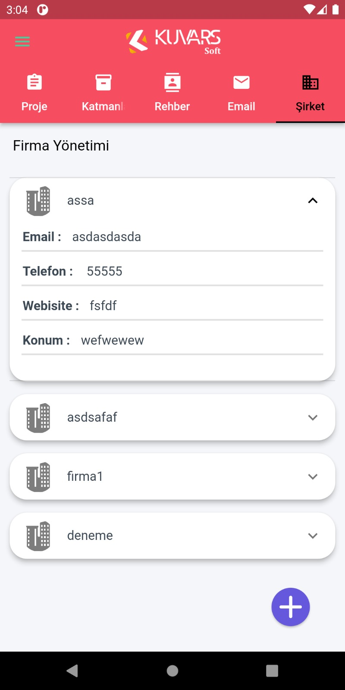

## 📱 State Management
I used MobX state management in this proeject.
<br>

```dart
import 'package:mobx/mobx.dart';

part 'reset_pass_view_model.g.dart';

class ResetPassViewModel = _ResetPassViewModelBase with _$ResetPassViewModel;

abstract class _ResetPassViewModelBase with Store {
  @observable
  bool isOpen = false;

  @observable
  bool isClose = true;

  @observable
  bool isButtonClose = false;

  @action
  void openToClose() {
    isOpen = !isOpen;
  }

  @action
  void closeToOpen() {
    isClose = !isClose;
  }

  @action
  void buttonCloseOrOpen() {
    isButtonClose = !isButtonClose;
  }
}
```


## 💻 Software Design Pattern
I used it singleton design pattern, abstract factory pattern, build and observer desing pattern in this project for performance.
```dart
import 'package:dio/dio.dart';

import '../../constants/app/app_constants.dart';

class NetworkManager {
  static NetworkManager? _instance;
  static NetworkManager? get instance {
    if (_instance != null) {
      return _instance;
    } else {
      _instance = NetworkManager.init();
      return _instance!;
    }
  }

  late final Dio dio;

  NetworkManager.init() {
    dio = Dio(BaseOptions(baseUrl: ApplicationConstants.instance!.baseUrl));
    dio.interceptors.add(
      InterceptorsWrapper(
        onRequest: (options, handler) {
          handler.next(options);
        },
      ),
    );
  }
}
```

## 📚 Software Architectural Pattern
I used MVVM software architectural pattern in this project.


## 🔍 Preview
#### 🔥 Login Page View


#### 🔥 Register Page View


#### 🔥 Reset Password Page View


#### 🔥 Project Page View


#### 🔥 Dashboard Page View


#### 🔥 Dashboard Settings Page View


#### 🔥 Contact Page View


#### 🔥 Mail Page View


#### 🔥 Company Page View



#### 🔥 Company Page View (UPDATED 💣)


#### 🔥 Profile Page View


